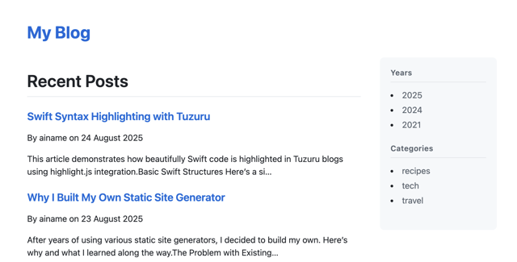

# Tuzuru


Tuzuru (綴る) is dead-simple static **blog** generator CLI that uses Git to manage your blog's metadata.

Instead of writing YAML front matter, you just write and save your plain Markdown files to Git. Tuzuru automatically pulls metadata like the publication date and author information from the Git commit history.

This means you can focus on what you're writing, not on remembering syntax. It's a simpler, more lightweight way to manage your blog.

## Motivation

Years ago, I built a blog with Hugo, but eventually stopped updating it. When I recently wanted to start again, I found it tough to remember and re-learn how to use it.

I wanted a simple, intuitive blogging tool, but none I tried felt quite right. So, I decided to build my own.

Tuzuru is designed with these core principles:

* Plain Markdown: No YAML front matter.
* Simple Routing: A routing system built specifically for blogs.
* No JavaScript Framework: Lightweight and fast.
* Single Binary Installation: Avoids environment setup for tools that you may not use day-to-day

## Installation

### Homebrew (macOS)

```bash
brew tap ainame/tuzuru https://github.com/ainame/Tuzuru
brew install tuzuru
```

### Manual Build

```bash
swift build -c release
cp .build/release/tuzuru /path/to/bin
```

## Getting started

You first need to set up a Git repo locally.

```bash
mkdir new-blog
cd new-blog
git init

# Initialize a blog project
# This adds `assets`, `contents`, `templates` directories and `tuzuru.json`
tuzuru init

git add .
git commit -m "init commit"
```

Then create a markdown file under the `contents` directory and do `git commit`.

``` bash
emacs contents/first-blog-post.md
git add contents/first-blog-post.md
git commit -m "First post"
```

When you make `git commit` becomes your post's published date.
Specifically, the first commit's Author Date for a markdown file under `contents` is the published date and also, author name will be taken from Git's config.

Now it's time to build your blog.

``` bash
tuzuru generate
```

You can now see the `blog` directory that can be deployed to GitHub Pages or your favorite HTTP server.
Or you can preview it with local HTTP server like `python3 -m http.server 8000 -d blog` and open `http://localhost:8000`.

### Built-in layout

The built-in layout is a great starting point and is easy to customize. It already includes [github-markdown-css](https://github.com/sindresorhus/github-markdown-css) and [highlight.js](https://highlightjs.org/) to make writing tech blog posts a breeze.




### Example project structure

```
my-blog/
├── contents/
│   ├── hello-world.md          # → /hello-world
│   ├── tech/
│   │   └── swift-tips.md       # → /tech/swift-tips (listed on /tech)
│   └── unlisted/
│       └── about.md            # → /about (not listed anywhere. You can link to /about from layout.mustache manually)
├── templates/
│   ├── layout.mustache
│   ├── post.mustache
│   └── list.mustache
├── assets/
│   └── main.css
└── tuzuru.json
```

### Demo

You can see Tuzuru in action with this demo blog hosted on GitHub Pages:

- **Live Demo**: [https://ainame.tokyo/tuzuru-demo/](https://ainame.github.io/tuzuru-demo/)
- **Source Repository**: [https://github.com/ainame/tuzuru-demo](https://github.com/ainame/tuzuru-demo)

This demo showcases the built-in layout and demonstrates how Tuzuru generates clean, lightweight blog pages from plain Markdown files.

## How it works

### Layout and customization

Tuzuru supports two types of pages.

1. Post - a blog article
2. List - a listing page generated automatically

You can customize these layouts using three Mustache files:

* templates/layout.mustache - Base layout
* templates/post.mustache - main part of post page
* templates/list.mustache - main part of list page

For more on syntax, see the documentation.
https://docs.hummingbird.codes/2.0/documentation/hummingbird/mustachesyntax/

### Listing and Unlisted Pages

By default, any Markdown file in the `contents` directory is automatically listed on:

* The home page (`/`) based on your configuration.
* Yearly archive pages (e.g., `/2025`, `/2024`).
* Category pages for files in subdirectories (e.g., `contents/tech/swift.md` is listed on `/tech`).

You can add an unlisted page by placing it in `contents/unlisted/`. These pages won't be listed anywhere automatically, but you can link to them manually from your templates.

### Assets

The `tuzuru init` command creates an assets directory containing `main.css`. The tuzuru generate command copies all files from this directory to `blog/assets`.

To prevent browser cache issues, use the `{{buildVersion}}` variable in your templates.


```mustache
<link rel="stylesheet" href="{{assetsUrl}}main.css?{{buildVersion}}">
```

### tuzuru.json

`tuzuru.json` is the main configuration file, though you can omit most settings if you stick to the defaults.


```javascript
{
  // `metadata` is the only mandatory section.
  "metadata" : {
    "blogName" : "My Blog",
    "copyright" : "My Blog",
    "description" : "My personal blog", // Meta description for SEO
    "baseUrl" : "https://example.com/",  // Production URL
    "locale" : "en_GB" // Affects the published date format
  },
  // `output` for configuring output options
  "output" : {
    "directory" : "blog", // The output directory
    "homePageStyle" : "all", // "all", "pastYear", or a number (last X posts)
    "routingStyle" : "subdirectory" // "subdirectory" (e.g., /hello-world) or "direct" (e.g., /hello-world.html)
  },
  // `sourceLayout` to customize the default directory structure (typically not needed)
  "sourceLayout" : {
    "assets" : "assets",
    "contents" : "contents",
    "imported" : "contents/imported",
    "templates" : {
      "layout" : "templates/layout.mustache",
      "list" : "templates/list.mustache",
      "post" : "templates/post.mustache"
    },
    "unlisted" : "contents/unlisted"
  }
}
```

## Import posts from Hugo project

You can import Markdown files from a Hugo project. Tuzuru will parse the YAML front matter to get the title, author, and date, then remove it. Each imported Markdown file will be added as an individual Git commit.

```bash
tuzuru import /path/to/import-target-dir # import them to ./contents/imported by default
tuzuru import /path/to/import-target-dir --destination /path/to/import
```

## Amend published date or author

Need to change a post's published date or author without rewriting your Git history? Use the amend command.

```bash
# Update published date
tuzuru amend contents/my-post.md --published-at "2023-12-01"

# Update author
tuzuru amend contents/my-post.md --author "New Author"

# Update both
tuzuru amend contents/my-post.md --published-at "2023-12-01 10:30:00 +0900" --author "New Author"
```

The command supports flexible date formats:

- `2023-12-01` (date only)
- `2023-12-01 10:30:00` (date and time)
- `2023-12-01T10:30:00Z` (ISO 8601 UTC)
- `2023-12-01 10:30:00 +0900` (with timezone)

This command creates a special marker commit that Tuzuru recognizes for post metadata, leaving your history clean.

## Build Requirements

- Swift 6.1+
- macOS v15+
